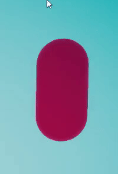
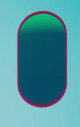
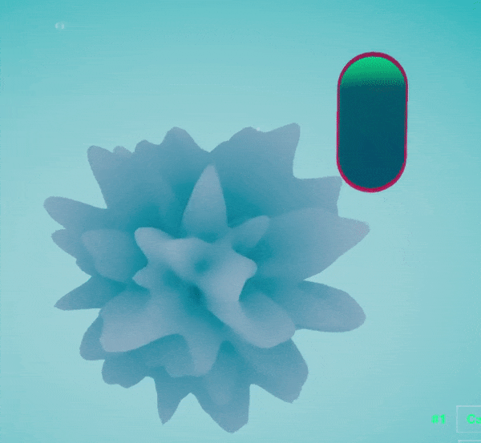
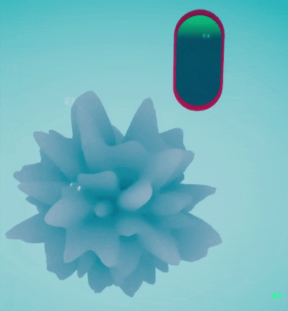
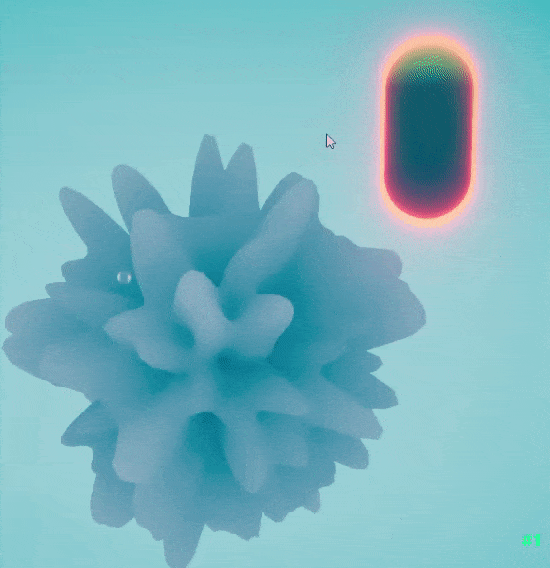

[](https://classroom.github.com/online_ide?assignment_repo_id=446589&assignment_repo_type=GroupAssignmentRepo)


**The University of Melbourne**
# COMP30019 – Graphics and Interaction

Final Electronic Submission (project): **4pm, November 1**

Do not forget **One member** of your group must submit a text file to the LMS (Canvas) by the due date which includes the commit ID of your final submission.

You can add a link to your Gameplay Video here but you must have already submit it by **4pm, October 17**

# Project-2 README

You must modify this `README.md` that describes your application, specifically what it does, how to use it, and how you evaluated and improved it.

Remember that _"this document"_ should be `well written` and formatted **appropriately**. This is just an example of different formating tools available for you. For help with the format you can find a guide [here](https://docs.github.com/en/github/writing-on-github).


**Get ready to complete all the tasks:**

- [x] Read the handout for Project-2 carefully.

- [x] Brief explanation of the game.

- [x] How to use it (especially the user interface aspects).

- [x] How you designed objects and entities.

- [x] How you handled the graphics pipeline and camera motion.

- [x] The procedural generation technique and/or algorithm used, including a high level description of the implementation details.

- [x] Descriptions of how the custom shaders work (and which two should be marked).

- [x] A description of the particle system you wish to be marked and how to locate it in your Unity project.

- [x] Description of the querying and observational methods used, including a description of the participants (how many, demographics), description of the methodology (which techniques did you use, what did you have participants do, how did you record the data), and feedback gathered.

- [x] Document the changes made to your game based on the information collected during the evaluation.

- [x] References and external resources that you used.

- [x] A description of the contributions made by each member of the group.

## Table of contents
* [Team Members](#team-members)
*  [Technologies](#technologies)
* [Explanation of the game](#explanation-of-the-game)
* [UI and AESTHETICS](#ui-and-aesthetics)
* [Graphics Pipeline and Camera](#graphics-pipeline-and-camera)
* [Procedural Generation](#procedural-generation)
* [The Outline Shader ](#the-outline-shader)
* [The Surface Noise Shader](#the-surface-noise-shader)
* [Particle System](#particle-system)
* [Evaluation](#evaluation)
* [Appendix](#appendix)
* [Credits](#credits)

## Team Members

| Name | Tasks |
| :---         |     :---:      | 
| Peter Skaltsis  | UI, Leaderboard, Menus & Scene Management |
| Matthew Hickson    |   Procedural Generation, AI, and Camera  |
| Ehsan Soltani Abhari   |  Perlin Noise Shader, Outline Shader and Camera |
| Cameron Grimwade   |  Arena, PowerUps, and Audio |

	
## Technologies
Project is created with:
* Unity 2021.1.13f1


## Explanation of the game

Petri-fied is a game about microorganisms growing and evolving inside a petri dish. The gameplay mechanics are loosely based on the web game “agar.io”, the player must eat food and smaller enemies to become larger and gain a higher score, players and enemies can use power-ups to get an advantage over each other, but if a player is eaten by a larger enemy, then it is game over.

This game was created as a procrastination aid, for people to play while they are doing other boring tasks, such as a student watching a lecture on zoom. We want players to instantly understand the basics of this game, but we also want them to learn and develop strategies to achieve the highest score possible.

## UI and AESTHETICS

Upon initialisation of Petri-fied, players are met with a simple start menu where they can choose any name they like, observe their unique player model ready to play, tweak settings and start the game. In addition to this, we also let the player adjust the game difficulty and view the basic game control keys, including movement and lock-on controls. Both of these additions were added as a result of the evaluation where many participants indicated these would be great additions.

  


  

Configuring settings was found to be quite important to a few evaluation participants, so we added a settings menu (seen next to the “Play now” button) in which you can configure the camera’s inversion (X and Y) and sensitivity, as well as whether the player should move towards a target that the player has ‘locked on’ to. Back at the main menu, players can hit the “Play now” button to start the main experience.

  


  

The player is now submerged in the petri dish arena, where the main objective is to conquer the leaderboard and become the most petrifying microorganism in the dish. Food in the form of green pellets/bacteria populate the screen in front of the player, which the player can move toward with WASD, and look at using either the mouse or arrow keys to control the camera. During development, we noticed the six degrees of freedom in the camera made moving toward objects, like food, in the game difficult. Which is why we introduced the ability to ‘lock on’ to enemies, food, superfood and powerups with the number keys 1, 2, 3 and 4.

  


  

Any decorative/less informative UI, such as the compass, was purposefully kept minimal and out of the way of the player’s line of sight. The compass is the moving NSEW indicator at the top of the screen, which helps the player orient themself in the dish as they look around, yet keeps visual obtrusion to a minimum.

  

This allowed us to display key information along the bottom of the screen for players to easily glance down at. On the left this includes the player’s name so they can identify who they are, as well as some stats such as survival time, peak score and the vertical angle in which they’re travelling. This vertical angle is less of a statistic, but it was found to be an important piece of information to give to players so that they could orient themselves.  
  

In the bottom center, players are able to see their genetic modifiers which evolve and increase with the player as they eat enemies. In order, the modifiers shown include:

-   Increased food score multiplier, which means the player can yield a higher score per food intake.
    
-   Increased speed multiplier, which means the player can go faster.
    
-   Lock-on radius multiplier, which means a player can lock-on to an object at a further distance.
    

  

This genetics UI element was added as a result of the evaluation rounds which revealed that participants were not aware that they could get an advantage in the game by eating enemies. Genetics and evolution are quite a unique part of our game which makes it more enjoyable, so it was very important to centre this component and make it very prominent.

  

As the player collects food, on the right side of the screen in the leaderboard interface they’ll notice their score and position or ‘rank increasing, creating a sense of competition. In early development, the leaderboard only displayed four players/enemies without a total player count. Though it became apparent through our observation and interviews that players felt like they were alone or only with three others in the arena, they also sometimes missed the leaderboard completely. In response to this, we increased the number of positions visible and added a large player rank and total number of entities at the top of the leaderboard. Some participants noted the score was slightly abstract, so we added a health indicator next to the player’s score to indicate it is the player’s vitals and size.

  

To increase the game's pace and keep the exploratory journey through the dish entertaining, players can eat powerups which are scattered throughout the game. When a player consumes one of these powerups, they will see the ability appear in the top left of the interface to indicate that it is active. This was one of the very last pieces of information we decided to display following an abundance of feedback from the evaluation rounds detailing how there was no way to tell what powerup you picked up.

  

During the game, players are also able to pause using the escape key where they can remind themselves of the controls, edit settings or forcibly end the game. This was important to add for players in chill mode who may want to end and see their statistics before logging off after hours of gameplay.

  


  

If a player is unfortunate enough to get eaten by an enemy, they will be presented with the game over scene which displays some interesting statistics regarding how long they survived, the final position they finished in and their final score. Their final character/model and the final state of the leaderboard is also displayed on this screen.  
From here, the game is extremely easy to keep playing with the “Play again” button, however, you may also exit the game here too.

  


  

Overall, all of the user interface is purely informative, providing the player with knowledge about a range of their statistics that they can improve through gameplay. The function is all within the game itself, to keep the game feeling immersive and importantly, simple.

In terms of creative/art direction, the UI consistently features a modern/lab HUD style to give players the feeling as though they’re watching their microorganism through some advanced headset. This overall style and framing came from an iterative process of exploring different UI design combinations as can be seen below:

  


  

A great deal of iteration was also undertaken post-evaluation to arrive at the user interface additions described above, such as the powerups, genetics and other improvements to the existing interface. Please continue reading in the evaluation section to find out more.

  
  

● How you designed objects and entities

We wanted our game to represent the evaluation of bacteria and other microorganisms therefore the model design of objects was quite important in order to invest the player in our concept. Our Game has three types of important entities, Food, Power-Ups, and Agents(player +enemies), we wanted each of these types to have a distinct look so that it was clear to the player which each was.

The food would be the most common object in the game as there could be hundreds on the screen at a time, therefore it was necessary to have a basic design to prevent frame rate drop from rendering large numbers of complex objects. We decided to have the basic food model be a green capsule, the capsule was a basic Unity shape and therefore would be optimised for a minimal rendering and collider cost, additionally, the capsule shape bears a resemblance to food pellets which are feed to small pets such as rabbits and fish, we believe this resemblance gives players the idea that capsules are meant to be eaten.


  

In addition to normal food we also wanted something rarer but more impactful, therefore we created an object called super food. This object acts like normal food but gives the player more score and has a different, more bright design to show the player it is more valuable.


The Power-Ups needed to be distant from the other assets to represent that they were not physical objects and that each had a unique effect. However, one important design choice that we made is that we wanted player’s to learn what the power-ups did through testing and experimentation, as while any player should instantly understand the basics of our game, we still want them to learn as they play. The model of the power-ups is a transparent cube with a smaller coloured cube inside, the colour of the smaller cube represents what effect the power-up has, this design is meant to clearly convey to the player that the power-ups are different from the other objects in the game, and each one has an effect on the player.


  

The models for our players and enemies was one of the most important visual components of our game, as the user would be constantly looking at these models. We believed the gameplay would be less engaging if the player was just a static model moving around. Therefore we wanted these objects to look like they were alive and be constantly moving therefore we created a complex shader to achieve this effect (more detail is given in the shader section of the report).

## Graphics Pipeline and Camera
**Graphics pipeline**
This game uses Unity’s default Built-in Render Pipeline. As we only made minimal graphical changes from the basic unity rendering process, there was no need to change to highly customizable rendering pipelines such as URP or HDRP. The changes made were in the vertex shaders and post-processing effects such as fog.
**Camera**
Petri-fied uses a 6 degree-of-freedom (dof) movement system and requires the player to have visibility of many objects simultaneously to make advantageous decisions. The camera is an orbiting third person camera utilising a spherical coordinate system to convert inclination and azimuth angles into a 3D coordinate system. These angles were used in the UI interface to inform the player which direction they are looking towards.**

The first design of the game used a bounding cylinder to contain all enemies. This design was overhauled after the second wave of evaluation as many testers provided feedback relating to difficulty managing the camera near the cylinder boundaries. After removal of the cylinder arena, the camera could freely rotate around the player without restriction mitigating raised critiques.

Fog is an essential aspect of the game upon first spawning as it restricts the player’s vision. The player’s vision is determined by a randomised genetic modifier determined on start-up of the game. Since the size scale of the player increases as they gain score, the camera and fog adjust accordingly to map to their new scale factor. The fog effect decreasing as the player’s score changed helped promote the concept of growth before eventually becoming sufficient enough to visualise most entities in the arena.

To optimise rendering time, the far clipping plane of the camera is also adjusted at runtime to prevent any far away game objects being unnecessarily rendered inducing lag.

## Procedural Generation
Throughout the process of developing this game, experimenting with various different setting parameters and taking into consideration feedback provided during both waves of evaluation, it was decided that the pacing of the game was paramount to maintaining meaningful engagement for players. Pacing in this context refers more specifically to the rate of enemy and player score growth, as well as the speed of agents as their score increases. Two primary methods were used to maintain suitable values for these properties. The first was to scale enemies with the player’s score by improving their starting modifiers, called in-game “genetics”, which accelerates their score growth. The second was utilising supervised random spawning of the various game entities throughout the arena. This supervised spawning is the primary implementation of the procedural generation system.

The evaluation process revealed that maintaining effective score growth was highly important in prolonging engagement and reducing boredom. A common issue in the late-stages of the game was becoming the top-score agent in the arena and then needing to wait increasingly longer for the enemies to reach competitive scores. The mitigating method utilised by Petri-fied is a series of controlled spawners determining appropriate spawn quantities, timings, and locations to ensure growth remains reasonably consistent as the player reaches different score thresholds, referred to as stages, during play. This report will address the following three stages of play. Early-game, which is when the player first spawns and has scores similar to the competitors. Mid-game, usually between 5-15 minutes of playtime. End-game, when the player is likely to be the top-score agent and the primary objective becomes attempting to get an arbitrarily high score before deciding to stop.

A core mechanic of Petri-fied is a small set of spawnable entities randomly spawning in a radius around an arena origin. The initial game design relied on a naive random system which used basic spawning parameters to regulate growth. This system was insufficient at maintaining pace beyond scores of 1,000. To combat this issue, an initial scale-to-player feature was implemented which demonstrated considerable improvement by maintaining comparable game-pace of the initial game until scores over 50,000. However, this implementation was prone to periods of score-growth stagnation during the mid-stages of play (5,000 - 25,000). Also the enemy speed increases made them too capable at securing other spawnable entities, hindering the player’s experience. Therefore, an integrated procedural spawning system was designed and implemented to ensure pace during all stages of play was consistent.

### Scale to Player

The scale to player feature was implemented post wave one of the evaluation phases. At the time, issues with overt speed reduction due to size increases were a common critique of the game as well as the inability for enemy agents to provide meaningful competition. Both initial food growth and speed modifiers were therefore scaled to better match the player’s current stage. This feature showed considerable improvement over the initial system, which demonstrated pace consistency by maintaining comparable game-pace to the wave one game until scores of 50,000+.

The key strength of this feature was both the player and enemies would benefit from scaling. The newly spawned enemies would receive significant buffs to their genetic modifiers and improve their chances of reaching the player’s score. Subsequently, the player also benefited from having improved enemies genetics to assimilate into their own, which prevented high score speed reduction issues.

**Integrated Procedural Spawner**

Most aspects of Petri-fied are randomly generated at runtime. This creates a dynamic environment that is constantly in flux, however, is also prone to generating game states unenjoyable for players. To mitigate this issue, an integrated procedural spawning system was developed. This system is composed of multiple sub-spawners which manage their own subset of entities whilst scaling in unison. Each sub-system, one for each spawnable entity type, would collaboratively contribute to maintaining pace during the appropriate stage. These spawnable entity types included: enemies, food, superfood, power-ups, and food-bombs. Each corresponds to a respective sub-system spawner that observes the state of the game and adjusts their spawning parameters dynamically to encourage score growth.

The primary method of determining the success of the integrated system was conducted numerous time tests, evaluating the proficiency for enemy score growth. The enemy score growth was the benchmark metric as their improved ability to gain score also improved the player’s score growth.

All spawning systems utilise the conceptual arena surrounding the player’s initial spawn by ensuring their spawn locations are within a scaling spawn radius. Each spawner will attempt to spawn one entity in a uniformly random position within this spawn radius. Otherwise, all spawners have an individual strategy for assessing where, and how many, entities to spawn to regulate the game state.

### Food Spawning

The food spawning had the most importance during the early-stages of playing. This food spawn sub system will prioritise spawns within the player’s field of view to promote simple yet highly successful growth strategies such as always going forward. This also meant the player could keep up with any enemies that spawned with highly favourable genetic modifiers. As well as, enemies were more likely to interact with the player at this stage of the game and therefore more player-enemy consumptions would occur which was noted to be vitally important to achieving higher score.

The next primary consideration was motivating the player to remain near the centre of the arena where typically the highest entity density occurred. However, should the player choose to loiter near the boundary, the food spawner would adjust the spawn location probabilities to incentivise the player to collect more centrally located items.

The last consideration for the food spawn was actually to deal with late-game stages where the value for the player to collect food decreased. At this point in the game, to preserve GPU computations, the number of random maximum food decreased which facilitated for more food-bombs to spawn. This aspect allows for periods of rapid score growth for agents lucky enough to be near the food bomb.

### Superfood Spawning

Superfood are a special category of consumable which instead of giving a fixed increment to the agents, would instead boost their score by a percentage of their own. As such, the importance of superfood increased as the average agent score increased. The super food was implemented to boost score growth during the mid and late stages of play. The superfood spawn rate and maximum amount allowed in the scene scale with the player’s log score to facilitate the detriment of faster enemies spawning and stealing them before the player had a chance to consume them.

### Food-Bomb Spawning

Combining aspects from the food and superfood spawner is the Food-Bomb spawner. A food-bomb is a special structure of standard food pellets spawning in an orbital cluster around a desirable item (either a superfood or food magnet). Food-bombs serve as dense pockets of score growth potential and naturally bring agents into similar locations as they seek out food.

As the player’s score increases the rate of food bomb spawning increases. Food bombs are the least frequent spawning item in Petri-fied as they have the potential to skyrocket growth for one or two fortunate agents and as such were intended to have more importance in the end-game stage when the player’s size begins to dwarf that of the singular food pellets.

  


### Power-Up Spawning

A power-up object has three possible variations of powers that can spawn. These include: super speed, food magnet, and invincibility. Each power up is generally an improvement to the agent’s success, however, in certain game states some are more likely to maintain success. For example, getting a magnet when many food pellets are present in the scene is generally better than invincibility. To do this, the power-up spawner system monitors the ratio of agents, food, and superfood present in the scene. When the ratios are in particular states, the probability of each particular power up is adjusted accordingly to better regulate the arena.

Power-ups are valuable items and allow for rapid score changes between agents. The arena containing many power ups often lead to overall higher average score gain amongst all living agents. As such, power ups would spawn throughout the arena upon any agent’s death. This facilitated newly spawned agents to quickly get through the early-stages of growth and reach competitive maturity.

### Enemy Spawner

Enemy spawning was the most important aspect of the procedural spawner. Scaling the enemies well and the number of enemies to spawn affected the pace of gameplay significantly. As the player’s score progresses, the maximum number of enemies that can spawn increases. Enemies essentially act as food collectors to which the player can eventually capitalise on themselves. The ability for the enemies to stay alive and gather score effectively directly influences the player’s same ability.

Unlike the other spawning system, the enemies have a unique spawn location system where they spawn away from other enemies, to prevent them from being eaten early in their lives. The spawner will determine the largest bounding sphere containing the existing agents in the arena and will spawn an enemy in the largest complementary bounding sphere still inside the spawn radius.

  


The figure above illustrates the spawner’s strategy. The first stage is determining the average position of all agents and then determining the largest possible bounding sphere that contains those agents. The spawner proceeds to determine the complementary bounding sphere (the next largest that fits in the spawn arena) and will spawn enemies randomly within that volume. This method ensures new enemies are spawning on the opposite side of the arena and away from other competitors.

The player and the enemies spawn with randomised genetics on initialisation. Enemies also have a range of behaviour modifiers influencing their target priority. These genetic and behaviour modifiers utilise bell curve distributions with manually defined means and standard deviations.

The combination of scaling and procedural spawning appears to produce consistent score growth for every stage of play. The average time it took enemies to reach the same score as the player was recorded for each iteration of the spawning system and the results are presented below.

| Score to get to | w/o Scaling (secs) | w/ Scaling (secs) | Scaling & Procedural Spawner (secs) |   |
|----------------:|-------------------:|------------------:|------------------------------------:|---|
|              10 |               0:17 |              0:15 |                                0:22 |   |
|             100 |               2:32 |              2:03 |                                1:57 |   |
|           1,000 |              11:22 |              4:01 |                                3:05 |   |
|          10,000 |                  - |              6:33 |                                4:17 |   |
|         100,000 |                  - |             10:50 |                                5:25 |   |
|       1,000,000 |                  - |                 - |                                5:15 |   |


## The Outline Shader
Files involved:
*  **Petri-fied/Assets/Shaders/LockOnOutline.shader**

One of the things we quickly realized when creating a game with 6 degrees of freedom (DoF) in movement, is that coming up with a good control/camera scheme is hard, and there are many challenges involved. There are many professional games that do not do this well (space games, flight games, etc.), and coming up with clever solutions for the challenges of 6 DoF is key to making such a game fun.

One such challenge was that, since the player character's forward movement is wherever the camera is pointing, that means that the player model blocks what is directly in front at the center of the screen. This issue becomes particularly noticeable when the player character grows larger in the late game and occupies a greater proportion of the screen: in such a situation, it becomes quite hard to aim for small things, like food particles, since the player cannot see directly in front.

At the same time, we came up with a "lock-on" idea. We imagined that many would-be players of this game might want to play on their laptops, whilst dozing off in a lecture theatre somewhere, without a mouse. Locking on to targets would make the game much more accessible to players on trackpads. While we did create the necessary gameplay elements for locking on, we did not have any visual way of showing the player what they were locked onto.

Thus we came up with the outline shader: we would create a shader which outlines around the selected target, shining around it and making it obvious that the player is locked onto it, as well as shining *through* things such as the player model, so that vision of it can never be obstructed.

We start the shader in **LockOnOutline.shader** only defining vertex positions in the input structs to the vertex and fragment shader. This is because the position of the vertex is the only thing we care about for this shader, since we will pick a custom outline color:
```c
struct vertIn
{
float4 vertex : POSITION;
};   

struct vertOut
{
float4 vertex : POSITION;
};
```
We will also define some properties to make the outline more configurable from the editor. We will define an outline color, as well as a minimum and maximum outline thickness. The min and max thickness parameters allow us to animate a "pulsating" outline effect around the target.
```js
_OutlineColor ("Outline Color", Color) = (0,0,0,1)
_MinOutlineThickness ("Min Outline Thickness", Range(1.05, 3.0)) = 1.1
_MaxOutlineThickness ("Max Outline Thickness", Range(1.05, 3.0)) = 1.2
```
If we wanted to have a static outline, we could simply multiply the position of each vertex in the vertex shader by some multiplier. This would have the effect of displacing all points on the mesh proportional to the multiplier. For example, multiplying all vertices by 0.5 would half their distance from the center of the mesh, whilst multiplying them by 2 would double it. This can be proven quite easily in 2D, and hence is shown below. The same concept extrapolates to 3D:
<p align="center">
  
</p>

In our case, since we just want an outline, the static multiplier would more subtle, such as 1.1:
```c
v.vertex.xyz *= 1.1f;
```
However, since we want to pulsate the outline, we will use this expression instead:
```c
v.vertex.xyz *= _MinOutlineThickness + ((_MaxOutlineThickness - _MinOutlineThickness) * (_SinTime.w + 1.0) / 2.0);
```
```_MaxOutlineThickness - _MinOutlineThickness``` gives us the difference between the min and max thicknesses, whilst ```(_SinTime.w + 1.0) / 2.0)``` gives us the a float that varies between 0 and 1, depending on the time (*since the Sin function outputs between -1 and 1, adding 1 to it and then halving the result would map that to the range 0 to 1*). Multiplying these two expressions together gives us a float that fluctuates between the minimum of 0 and the maximum of the difference between the min and max thickness.

Adding the above result to ```_MinOutlineThickness``` gives us a float fluctuating between the minimum thickness and the maximum thickness parameters. We can now uses this float as a multiplier to our vertex positions make the outline grow and shrink between the given minimum and maximum outline thicknesses.

Once we have displaced our vertex, we need to transform its position from what it is currently, in model space, into the game world (view space), and then project that 3D position in the game world onto our 2D screen. To do so, we can multiply the current position of the vertex by the model, view and projection matrices, which we can do in one step using the built-in unity ```UnityObjectToClipPos()``` function:
```c
o.vertex = UnityObjectToClipPos(v.vertex);
```

In the fragment shader, we can simply output the given ```_OutlineColor``` parameter to get the desired outline color:
```c
fixed4  frag (vertOut i) : COLOR
{
fixed4 col = _OutlineColor;
return col;
}
```
<p align="center">
  
</p>

Ok, we got the pulsating effect, but the result is not actually an outline. We are simply changing the color of the original object, and the making its vertices grow and shrink between two parameters. To make the effect an outline, we will need to create multiple passes, as well as changing some Shaderlab settings.

First, we will define a main color (*and texture if we want to use textures in the future*) property, which we will use to change the color of the main object itself:
```js
_MainTex ("Texture", 2D) = "white" {}
_MainColor ("Main Color", Color) = (0.5,0.5,0.5,1)
```
Then we will abstract the previous shader code into a pass, and at the top of the pass we will turn the **ZWrite** Shaderlab setting off:
```c
Pass
{
	ZWrite off
	...rest of code
}
```
Turning **ZWrite** off means that z-buffer depth information will not be stored for this pass, and is typically used for transparent objects. When z-depth information is not stored, objects behind (depth-wise) the outline will still be rendered over it. This means that we can draw over this outline in a subsequent pass and not have to worry about out outline obstructing the main object within the outline.

Now in the next pass, we will render the object itself, without displacing its vertices. We will simply pass the main color and texture properties in, and render the object over the outline. Since this pass is placed *after* the outline pass, and the fact that we do not store depth buffer information for the previous pass, our main object will be rendered over the outline.

The actual rendering of the object is simply Shaderlab boiler plate code to make sure it works correctly with the lighting, with the only key part being that we turn **ZWrite** back on since we do want our main object's z-depth to be taken into account when rendering (*so that it will be rendered in front of other objects when it is in front of them with respect to the camera*). Since there is no vertex or fragment shader in this pass, and it is not in HLSL, it will not be explained in more detail:
```c
Pass {
	// We need to store z-buffer depth information so that the actual object renders over the
	// outline object
	ZWrite on
	Lighting on

	Material {
		Diffuse[_MainColor]
		Ambient[_MainColor]
	}

	SetTexture[_MainTex] {
		ConstantColor[_MainColor]
	}
	  
	SetTexture[_MainTex] {
		Combine previous * primary DOUBLE
	}
}
```
And now our actual object renders over the outline. When given min and max outline properties that are over 1 (1.05 and 1.15 in this case), the outline will appear around our object, since that is the only part of the outline which is not overwritten by the main object itself:
<p align="center">
  
</p>

Ok, we have the outline, but as mentioned at the start, we also want our outline shader to render through other objects, when the main object itself is obstructed. When an object is obstructed from the camera (as determined by z-depth information) the obstructing object will be rendered over it. So when our object goes behind the wall, we only see the wall, and not the object anymore. Since we do not even store the z-depth information for our outline, everything will be rendered over it, including objects behind it (from the camera's perspective).

To address this issue, we can use the Shdarlab **ZTest** setting. By setting **ZTest** to **Always**, we ensure that the rendering engine will not perform z-depth testing on the geometry for this shader, ensuring that it is always rendered. This will means that the outline shader will render *through* other objects. However, since **ZWrite** is off and since the next pass will draw the main object itself, the main object will still render over the outline.
```c
ZTest always
```
So let us summarize the chain of events for better clarity:
* In the first pass, we draw the outline itself and set **ZTest** to *Always*, to make sure that it renders through everything.
* In the second pass, we render the object itself. Since **ZWrite** was off in the first pass, the second pass will overwrite the first pass, drawing the main objects on top of the outline.
* However, when the main object is obstructed by something, such as the player model, it will not be rendered (since **ZTest** is not set to *Always* in the second pass), which will means that the outline will be rendered instead, which will be visible through the obstructing object, giving us a very cool targeting effect.
<p align="center">
  
</p>

Ok we got the basic effect, but let's make it more interesting. When the object is obstructed and the outline is shining through things, let's also add a hollow inside part for where the object used to be. To do this, we can simply add a pass between our outline pass and the main object pass. This intermediate pass will be similar to the outline pass in that we will keep **ZWrite** *off* and **ZTest** to *Always*:
```c
Pass {
	ZWrite off
	ZTest always
	...
```
However, we will not change the position of the vertices. This will ensure that they are rendered at exactly the same place the main object will be rendered. When the main object is not obstructed, this inside part will not be shown, otherwise it will render through other objects.
```c
vertOut vert (vertIn v) {
	vertOut o;
	o.vertex = UnityObjectToClipPos(v.vertex);
	return o;
}
```
We can then define a property for the inside color:
```c
_InsideColor ("Inside Color", Color) = (0,0,0,1)
```
And then return that color in the fragment shader of the pass:
```c
fixed4  frag(vertOut i) : COLOR {
	fixed4 col = _InsideColor;
	return col;
}
```
And now we get our cool effect:
<p align="center">
  
</p>

Almost done. Let's add one more interesting feature: shining outline, or bloom. Now there is a way to handle bloom purely from a shader, which looks great but is quite a bit more work. We can cheat and achieve a similar effect with significantly less work. Since we are not using bloom for anything else in the scene, we can simply create a postprocessing volume in unity, then set the bloom threshold to be higher than 1; say 2. This means that ordinarily objects will not be affected by bloom, unless their color intensity reaches 2. We can then add a multiplier to our returned color for the outline pass in the fragment shader, to ensure that the color intensity is over 1, and our outline will be affected by bloom:
```c
fixed4 col = _OutlineColor * 10;
```
<p align="center">
  
</p>

The shader here was inspired by the following sources:
* *Shader - Smooth Outline* youtube.com/watch?v=SlTkBe4YNbo
* *Outlined Diffuse Shader Fixed for Unity 5.6* https://github.com/Shrimpey/Outlined-Diffuse-Shader-Fixed
* *SILHOUETTE Highlight / Outline / Glow Diffuse Shader in Unity* https://www.youtube.com/watch?v=00qMZlacZQo
* *Stack Overflow* https://stackoverflow.com/questions/57267289/how-to-make-3d-object-visible-behind-wall-but-invisible-if-behind-wall-and-unde
* https://www.reddit.com/r/Unity3D/comments/3q3whw/need_to_make_a_shader_that_produces_a_silhouette/

## The Surface Noise Shader
Files involved:
* **Petri-fied/Assets/Shaders/PerlinNoise.cginc**
* **Petri-fied/Assets/Shaders/SurfaceNoise.cginc**
* **Petri-fied/Assets/Shaders/SurfaceNoise.Shader**

During the inception of the project, one of our key ideas was to replicate the look of an organic object: a membrane of fat floating around in water. For example, something inspired by the image below:

<p align="center">
  
</p>

*Image from https://agfundernews.com/wp-content/uploads/2016/10/13597144015Um.jpg*

Given that the base models of our microbes are spheres, randomly displacing the sphere vertices seemed like a good approach. Of course doing so in a purely random manner would not be sufficient as we would end up with complete randomness and sharp, jagged edges. Thus, inspired by Jarrod's Perlin noise lecture, we decided to use Perlin noise to get a more organic and smooth look.

The initial approach was simple. Unity has a built in Perlin noise function ```Mathf.PerlinNoise()```, thus we can feed each vertex to the function, get the corresponding Perlin noise value, and then displace the vertex using said value to generate the final mesh. Of course there was the problem of our vertices being 3D points on a sphere, whilst the unity function is a 2D implementation. Hence we needed a function to map each 3D point to a unique 2D point, but nothing that a quick copy paste from StackOverflow couldn't solve.

And voila! Our initial implementation of organic-looking objects was complete. We could increase the number of vertices on the base sphere to get a variety of different shapes:

<p align="center">
  
</p>

Or, we could change the offset given the Perlin noise function:
<p align="center">
  
</p>

Done! There is one problem however: the microbe looks much more interesting when we move one of the settings sliders. As the mesh changes, the way the surface of the microbe moves looks much more "organic" than when completely static. To address the issue, we could change the Perlin offset every frame, and regenerate the mesh. However, to do this for every microbe in the game would be hugely costly on the CPU. Moving tens of thousands of vertices every frame on the CPU is not a good solution!

Thus we instead decided to achieve this effect using a shader. Manipulating all of these vertices on the (often hundreds) of GPU cores would greatly improve performance on devices with GPU capabilities. Unfortunately for us, the Perlin noise function is not available to us on the shader. While there is a ```noise()``` function, it is not available to us in the vertex and fragment shaders in the context we want to use them. Hence we must implement our own Perlin noise function from scratch in the shader. Since this is also a perfect opportunity for us to understand and learn the Perlin noise algorithm, we decided to take undertake this task.

To explain Perlin noise and our implementation of it, we will start with a 1D explanation, then since a 3D explanation is quite hard to visualize, we will explain the process in 2D and then extrapolate to our 3D implementation. We will heavily rely on Linkoping University's Stefan Gustavson and his 2005 paper, "*Simplex Noise Demystified*" in which he explains Perlin (and Simplex) noise in great detail.

The core idea starts with Gradient noise. Gradient noise is the idea of using random gradients to generate random numbers. In 1D, we have a number line, and for each integer on the line, we assign a random gradient. Then, for any given point, we find which two integers it lies in-between, and extrapolate the gradients of these two points. Whichever gradient reaches our desired x-value first, then the corresponding y-value of the gradient at the point would be our pseudo-random value. Of course this method of linear interpolation would give us sharp transition points:

<p align="center">
  
</p>

So we can use an ease curve to smooth the interpolation:

<p align="center">
  
</p>

*Images from https://rtouti.github.io/graphics/perlin-noise-algorithm*


The whole process is shown nicely by this diagram in Gustavson's paper:

<p align="center">
  
</p>

*Image from https://weber.itn.liu.se/~stegu/simplexnoise/simplexnoise.pdf*


To extrapolate this to 2D, Ken Perlin replaced the line with a grid, and for each corner point of the grid, he would come up with a random gradient. Then the random number for any point on the grid would be the interpolation of the dot products of each of the 4 surrounding corner points' gradient vector, and the vector from the corner point to the point itself:

<p align="center">
  
</p>
<p align="center">
  
</p>

*Images from https://rtouti.github.io/graphics/perlin-noise-algorithm*


For our purposes, to further extrapolate this idea to 3D, we use a 3D grid, where each point on the grid would be on or within a cube, surrounded by the 8 vertices of a grid cube. Thus, to calculate Perlin noise in 3D, we must come up with 8 random vectors for the surrounding grid points, and take their dot products with the corresponding vector to the input point, interpolating the results to get the final Perlin value for the given point.

Thus we begin our HLSL Perlin noise function by taking the floor of the x, y and z coordinates of the given input point, which will give us the bottom corner point of the 3D cell which encloses our point (X,Y,Z):
```c
float  perlin3d(float3 inputPoint) {

	// Find the base point: The bottom corner point on the grid cube which

	// contains our point

	int X = int(floor(inputPoint.x));

	int Y = int(floor(inputPoint.y));

	int Z = int(floor(inputPoint.z));
```

We can then calculate the relative progress of each coordinate of our point from the bottom corner of the cube:
```c
float x = inputPoint.x - float(X);

float y = inputPoint.y - float(Y);

float z = inputPoint.z - float(Z);
```
Now we need a way to pick a pseudo-random gradient for each of the corner points. There are different ways that we could go about this, however we will follow Gustavson's approach, which itself follows Ken Perlin's original approach (*some of the other approaches use loops, which do not work efficiently within a GPU context*).

We start by defining an array, we call **permutations**, which contains a random shuffling of the numbers 0 to 255. According to Gustavson, many Perlin noise implementations have traditionally used the same permutation array as the one defined originally by Ken Perlin. We will follow suit and use the same array. To avoid an index overflow issue that will be described later, we will double the size of the array and duplicate all elements in the same order. This will reduce the need for index wrapping, as integer modulus operations can be a bit more expensive on the GPU.
```c
static const  int permutations[] = {
151,160,137,91,90,15,180,...,151,160,137,91,90,15,...180
};
```
Now we must map each of the corner points to one number in the permutations array, and then use that number to assign a gradient to that corner point. There is one thing to keep in mind however: the way we map a coordinate to a number has to be consistent across grid cells. That is, as shown in 2D for the figure below, **point A** is part of the 4 surrounding grid cells (*in 3D it would the 8 surrounding cubes*). If our input point is inside any of these 4 cells, then no matter which one it is in, the value we calculate for **point A** ***must be the same***. This will result in us picking the same gradient vector for **point A** every time, which is a very important aspect of achieving smooth pseudo-randomness with this algorithm. Otherwise, we would end up with sharp jagged transitions across grid cells.

<p align="center">
  
</p>

To achieve this consistency, we can use the following mapping function:
```c
X %= 255;

Y %= 255;

Z %= 255;

// Pick a number from the permutations array for each corner point

int gradientIndex000 = permutations[X + permutations[Y + permutations[Z]]] % gradCount;

int gradientIndex001 = permutations[X + permutations[Y + permutations[Z + 1]]] % gradCount;

int gradientIndex010 = permutations[X + permutations[Y + 1 + permutations[Z]]] % gradCount;

int gradientIndex011 = permutations[X + permutations[Y + 1 + permutations[Z + 1]]] % gradCount;

int gradientIndex100 = permutations[X + 1 + permutations[Y + permutations[Z]]] % gradCount;

int gradientIndex101 = permutations[X + 1 + permutations[Y + permutations[Z + 1]]] % gradCount;

int gradientIndex110 = permutations[X + 1 + permutations[Y + 1 + permutations[Z]]] % gradCount;

int gradientIndex111 = permutations[X + 1 + permutations[Y + 1 + permutations[Z + 1]]] % gradCount;
```
We wrap X, Y and Z to ensure that we do not get an index overflow, and then use the formula ```X + relativeX```, ```Y + relativeY``` and ```Z + relativeZ``` (*the ```% gradCount``` will be discussed below*). This formula guarantees that corner points are always assigned the same index, which in turn ensures that the same number is picked from the permutations array. We can illustrate this easily in 2D (*the same extrapolates to 3D*):

<p align="center">
  
</p>

In the above figure, we can see that when we have any point within **cell A**,  X = 3 and Y = 4, and hence the index calculated for point (4,5) would be **permutations[3+1]+4+1** which gives us **permutations[4]+5**. This is because point (4,5) is 1 point in x beyond the bottom corner x (hence relativeX = 1), and also 1 point in y (hence relativeY = 1).

Similarly, if we have any point in **cell B**, X = 4 and Y = 4, and thus the index for point (4,5) would be **permutations[4+0]+4+1** which gives us **permutations[4]+5**. This is because point (4,5) is zero points in x beyond the bottom corner x of **cell B** (hence relativeX = 0), and 1 point in y above the bottom corner y (hence relativeY = 1). Notice that in both cells we got permutations[4]+5 for the same point, which means when we use the resulting value as an index into the permutations array, we will get the same value assigned to the same corner point.

It is worth mentioning that with the mapping method above, the resulting index calculated could be greater than 255, since we are adding two numbers from 0 to 255 together. This is why we doubled the size of the permutations array, to avoid index overflow.

Now, we must somehow translate each pseudo-random value assigned to each corner point into a gradient for that corner point. To do so, we will define a random array of gradients, wrap our corner value by the size of this array (```% gradCount```), and then use that as an index to access a random gradient within the array. As described by Gustavson, this gradients array should hit a balance: having too few random gradients will not hide the fact that our function is not truly random well, whilst having too many will make the function "too noisy". Thus we will follow Ken Perlin's recommendation for 3D, and take the set of mid-points of each of the 12 edges of a cube centered on the origin:

<p align="center">
  
</p>

*Image from https://weber.itn.liu.se/~stegu/simplexnoise/simplexnoise.pdf*


```c
static const  int gradCount = 12;

static const  float3 gradients[] = {

float3(1,1,0),float3(-1,1,0),float3(1,-1,0),float3(-1,-1,0),

float3(1,0,1),float3(-1,0,1),float3(1,0,-1),float3(-1,0,-1),

float3(0,1,1),float3(0,-1,1),float3(0,1,-1),float3(0,-1,-1)

};
```
And now we can use our index and gradients array to pick a pseudo-random gradient for each point:
```c
float3 gradient000 = gradients[gradientIndex000];

float3 gradient001 = gradients[gradientIndex001];

...and so on
```
That's the first vector for each point done! Now we must calculate the second vector, which is simply the vector from the corner point to the given input point. We can do so by subtracting our point's relative x, y, z values we calculated before, and subtracting from them the relative coordinates of corner point (*relative to the bottom corner, so in 2D the bottom corner of the cell would be (0,0), whilst the top right corner would be (1,1)*):
```c
float3 corner000ToPoint = float3(x, y, z);

float3 corner001ToPoint = float3(x, y, z-1.0f);

float3 corner010ToPoint = float3(x, y-1.0f, z);

float3 corner011ToPoint = float3(x, y-1.0f, z-1.0f);

... and so on
```
With the two vectors for each point calculated, we can compute the dot product:
```c
float dotValue000 = dot(gradient000, corner000ToPoint);

float dotValue001 = dot(gradient001, corner001ToPoint);

float dotValue010 = dot(gradient010, corner010ToPoint);

... and so on
```
With the dot products for each of the 8 corners of our cube calculated, we can now interpolate to the results to get our final noise value. As mentioned previously, a pure linear interpolation would result in sharp transitions. Since we want our Perlin Noise to look smooth, we can use the ease curve suggested by Ken Perlin: **6t^5^ - 15t^4^ + 10t^3^**

<p align="center">
  
</p>

*Image from https://weber.itn.liu.se/~stegu/simplexnoise/simplexnoise.pdf*


We will use Gustavson's implementation for this function:
```c
float  fade(float t) {

	return t*t*t*(t*(t*6.0f-15.0f)+10.0f);

}
```
Using the function we will smooth our relative x, y and z values:
```c
float u = fade(x);

float v = fade(y);

float w = fade(z);
``` 
And then use the result to interpolate our dot products. First we interpolate pairs of values using the smoothed x:
```c
float bottomFrontX = lerp(dotValue000, dotValue100, u);

float bottomBackX = lerp(dotValue001, dotValue101, u);

float topFrontX = lerp(dotValue010, dotValue110, u);

float topBackX = lerp(dotValue011, dotValue111, u);
```
Then we interpolate resulting pairs using the smoothed y:
```c
float frontY = lerp(bottomFrontX, topFrontX, v);

float backY = lerp(bottomBackX, topBackX, v);
```
Finally, we interpolate the last pair using the smoothed z to get our Perlin noise value:
```c
float finalNoiseValue = lerp(frontY, backY, w);
```
With our Perlin noise function completed, we can place it in a **cginc** file called **PerlinNoise.cginc** so that we can reuse it across our shaders by simply typing ```#include PerlinNoise.cginc```

Now, we can define a vertex shader which calculates a Perlin noise value for each vertex, and then displaces the vertex using that value. Some additional control can be introduced into the formula, such as a **_Scale**, where a higher scale "zooms out" of the Perlin noise, and an **offset**:
```c
float perlinNoise = perlin3d(_Scale * v.vertex + float3(_Time.y + _OffsetX, _OffsetY, 0.0f));
v.vertex *= perlinNoise + _AdditionalOffset;
o.vertex = UnityObjectToClipPos(v.vertex);
```
*Note that this part also involves multiplying each vertex by the MVP matrix to get them in to clip space, using the ```UnityObjectToClipPos()```. However this step was explained in the outline shader section, so see that section for the explanation.*

Furthermore, to give a better appearance of depth to our shader, we can pass the Perlin value down to the fragment shader. We will do so by using the TEXCOORD0 channel defined in the vertex shader output struct:
```c
struct vertOut
{
float4 vertex : SV_POSITION;
float2 noise : TEXCOORD0;
};
```
And pass the value in the vertex shader. Although our noise value is (*most of the time*) within the range -1 to 1, and colors are from 0 to 1, so we need to map the value between the two ranges before we pass it down:
```c
o.noise.x = (perlinNoise + 1.0f) / 2.0f;
```
In the fragment shader:
```c
fixed4 color = fixed4(i.noise.x / 1.5f, i.noise.x / 1.5f , i.noise.x / 1.5f, 1);
```
Finally, we can introduce some properties which allows us to output different colors for when our microbes have picked up different powerups. We define these properties at the top of the file:
```c
_IsInvincible ("Invicibility Effect", Float) = 0.0
_IsSpeed ("Speed Powerup Effect", Float) = 0.0
_IsMagnet ("Magnet Powerup Effect", Float) = 0.0
```
Which we then use in "if" statements to get different color effects. Here, we use expressions such as ```(_SinTime.w + 1.0f)``` or ```(sin(_Time.w * 1.7f) + 1.0f)``` to get a shader which changes color over time.
```c
if (_IsInvincible > 0.1) {
  color = fixed4(i.noise.x / 1.5f, (sin(_Time.w * 1.7f) + 1.0f) / 2.5f , i.noise.x / 1.5f, 1);
}
if (_IsSpeed > 0.1) {
  color = fixed4((sin(_Time.w * 1.7f) + 1.0f) / 2.5f, i.noise.x / 1.5f , i.noise.x / 1.5f, 1);
}
if (_IsMagnet > 0.1) {
  color = fixed4(i.noise.x / 1.3f, i.noise.x / 1.3f , (_SinTime.w + 1.0f) / 2.0f, 1);
}
```
And now we can display "organic-looking" objects on screen:
<p align="center">
  
</p>

The shader work displayed here was inspired by the following:
* *Perlin Noise: A Procedural Generation Algorithm* https://rtouti.github.io/graphics/perlin-noise-algorithm
* *Stefan Gustavson's Simplex Noise Demystified, Linkoping University 2005* https://weber.itn.liu.se/~stegu/simplexnoise/simplexnoise.pdf


## Particle System
The particle system to be evaluated is the BackgroundBubbleEffect, this system spawns bubbles in the proximity of the player. The particle system is set to create bubbles inside an area around the player, this area grows and moves with the player, however the bubbles themselves are not connected to the player’s size or movement and will slowly move upwards before disappearing. While this is far from the most complex particle system we created, it is the most important for immersing the player into the game.

The BackgroundBubbleEffect and the FollowBubbleEffect (which spawns bubbles directly off the player and enemies) are meant to give the player the feeling that they are moving around underwater, this small immersion effect is vital in making the player think they are controlling a microorganism in a petri-dish and not an abstract object in a game environment. The BackgroundBubbleEffect also provides the player with a sense of scale, as in the early game the bubbles are quite large, but in the late game when the player is larger the bubbles look very small, giving players a sense of pride and accomplishment about how much they have grown.

## Evaluation
User evaluation was conducted in two separate waves of testing. During the first wave, users tested the game and provided initial feedback. This feedback was reviewed and certain features were implemented for trialing with a second wave of people. This multistage testing was done to determine how effective the proposed solutions to the initial feedback were. During both waves of testing, the use of two evaluation methods were utilised. One was an Observational Method of Cooperative Evaluation, and the oher a Querying Method in the form of a questionnaire/interview.

For the Observational Method of Evaluation, testers were observed whilst playing through the game with minimal guidance. As they experienced the game, notes on how they played were collected, as well as the strategies they used to progress their score. Any technical or gameplay challenges they came across were recorded and minimal information regarding game features was provided to them. The aim was to let them experience the game for themselves as much as possible by only providing assistance where necessary and keeping careful notes of what complications they had.

For the Querying Method of Evaluation, the users were asked to play through the game in their own time, after they had finished, they were interviewed about their experience with the game. These questions included open-ended questions so testers could share the experiences of the game, and scalar rating questions between one and five to get a quantitative understanding of how the testers responded to particular game features. All questions asked can be found in the appendix.

The target demographic of Petri-fied is primarily students aiming to play a casual game instead of paying attention in class, and as such, testing was focused on people aged between 16 and 26 either currently studying at university or high school. In summary, for each wave, 3 people were tested per evaluation methodology for a total of 12 people.

  
  

To make our evaluation more readable we have greatly summarised/generalised our user feedback, the more detailed version of our participant responses can be found in the appendix.

  

Observational Method Wave 1:

This section involves Participants A, B, C.

During the Observational Evaluation the common theme of the participants were:

-   Participants quickly learnt game mechanics
    
-   Participants mainly used the feature lock-on to move round
    
-   Participants had problems identifying if an enemy was larger or smaller than the player
    
-   Participants didn’t enjoy how the game slowed down as the player got larger
    

  

Querying Method Wave 1:

This section involves Participants D, E, F.

The quantitative questions in the Querying Evaluation had similar responses to the Observational

-   All participants greatly enjoyed gameplay elements, and found the visual aesthetic
    
-   Most complaints were directed towards the pace of the game at higher scores, or about the difficulty of using some of the controls.
    
-   Participants thought the UI did not display enough information
    
-   All the participants suggested adding functionality to change the difficulty of the game.
    

  
  

Changes made from the first wave of testing feedback:

-   To fix confusion over what controls to use, visual keys were added to the main menu to show player’s what controls are available before they begin.
    
-   To help players move around with greater ease, lock-on priority was improved for food and enemies, and auto-movement feature was added so players don’t need to hold W to go forward.
    
-   Many of the testers (Participants B, C, D, E) had problems with the pace of the game slowing down as the player got bigger, as discussed in the procedural generation section, the difficulty of enemies so in the later stages of the game they are spawned larger and are faster.
    
-   We also buffed the effects of power-ups, making them stronger and last longer, so that they are more impactful in the late game
    
-   Participants A, B & C all had problems identifying if an enemy was larger or smaller than the player, to fix this we changed the lock-on feature so that the enemies glow white if they are smaller than the player, while if they are larger than the player, they glow red instead when they are locked-onto.
    

  

Observational Method Wave 2:

This section involves Participants G, H, I.

The General observations during this evaluation were:

-   All Participants quickly understood they needed to eat the green food objects and noticed this increased their score in the leaderboard
    
-   None of the Participants realised that their stats were changing after eating enemies
    
-   Once participants reached the highest score in the game, they found it easy to maintain their lead
    
-   Participants generally enjoyed the visual aesthetics and the sound design of the game.
    
-   Participants found that there was a lack of food in the early stages of the game, and that they would have enjoyed a higher food density.
    

  

Querying Method Wave 2:

This section involves Participants J, K, L.

The general feedback from participant in this evaluation were:

  

-   Participants commented that they found that eating enemies was particularly satisfying, and that it was quite fun hunting enemies and remaining at the highest score in the game
    
-   Participants had issues with the earlier parts of the game, as the food and enemies were sparse and far apart when compared to the player’s movement speed
    
-   Participants said that they wanted a screen showing the button layouts so that they could check what each button did without having to restart the game and look at that main menu.
    
-   Participant were divided on if dispersion of the food and enemies was too sparse
    
-   All three Participants thought that the game’s objective of growing bigger and eating things was very clear and intuitive
    
-   Each participant had unique ideas for improvement and variations (see appendix for more details)
    

  
  

Changes made from the first wave of testing feedback:

  

-   As many of the participants didn’t encounter many power-ups, we increased the spawn of power-ups, reduced enemy ai weight to pick-up power-ups, this would allow the player to use more power-ups.
    
-   After realising some testers (participants I, J & L) had confusion over some of the control during the game, we decided to add the button display from the main menu to the pause menu, so that players can check the control layout at any time without it getting in the way of the in-game UI.
    
-   Both participants L and K wanted to know how many enemies were in the game so we added the total number to the in-game leaderboard UI.
    
-   More than half of the participants in both waves of testing had issues or bugs with the arena. To fix this we decided to remove the arena and replace it with a system that if a player moves outside the bounds they will be teleported to the other side. We also changed reduced the entity spawn range to encourage players to remain near to the action
    
-   We changed the sound levels of many to make repetitive sounds less loud and annoying as we felt that repetitive sounds can reduce a game quality, and by reducing their volume they can be less annoying.
    
-   Many players in the Second testing wave felt that the density of the food and enemies was too sparse, to solve this we overhauled our spawning system to be less random and more procedural so that the player would always have a minimal amount of action nearby,
    
-   The previous change meant spawning many more objects into the game at once, this could reduce fps and create lag which would affect the player’s experience. To prevent potential lag, instead of Instantiating new food we teleport food from an external pool to the game area, then when the food is destroyed it is teleported back to the pool, saving CPU cost as moving objects is cheaper than creating and destroying them.
    
-   A major problem that we noticed in both the observation method and the interview is that none of the players realised that their modifiers were changing as they were eating enemies until we told/asked them. From creating the game we wanted players to evolve in multiple ways so the growth of genetic modifiers was an important feature to us. Therefore to make it clear to players that this feature existed and had an impact on the game we add genetic modifiers at the bottom of the UI so that players could know how their stats were changing.
    
-   To further improve the player’s understanding of the game we made the following improvements to the UI
    

-   Added what power-ups were active on the player
    
-   Show the player’s highest achieved score
    
-   Increased leaderboard positions visible, and display the total number of enemies
    

-   Score decay was reduced to facilitate late game stages more fairly.
    
-   Difficulty presets were added to the main menu screen
    
-   A heart indicator was added to the player’s leaderboard row to promote the idea of health.

**For Presentation proposes we have merged the results of the scalar questions from Wave 1 and Wave 2 onto one table so it is easy to compare.**
| Question                                                                     | Average Rating for Wave 1 between 1-5,  (Participants D,E,F) | Average Rating for Wave 2 between 1-5 (Participants J,K,L) |
|------------------------------------------------------------------------------|--------------------------------------------------------------|------------------------------------------------------------|
| How comfortable did you find the movement controls?                          |                                                  3.666666667 |                                                3.666666667 |
| How much did the game feel like you were in a competition?                   |                                                  3.333333333 |                                                3.333333333 |
| How comfortable did you find the mouse control?                              |                                                            3 |                                                        3.5 |
| How enjoyable was the pace of the game?                                      |                                                  3.666666667 |                                                          4 |
| How easy did you find the game?                                              |                                                            4 |                                                4.666666667 |
| How confident do you feel with the camera control?                           |                                                  3.666666667 |                                                3.666666667 |
| How appropriate was the difficulty of the game?                              |                                                            4 |                                                3.333333333 |
| How informative did you find the UI?                                         |                                                  2.333333333 |                                                3.333333333 |
| How confident do you feel using the lock-on feature?                         |                                                  4.333333333 |                                                4.666666667 |
| How much did you like the character model generated for you?                 |                                                  4.666666667 |                                                          5 |
| Was the variety of power-ups enough to keep you interested?                  |                                                  2.666666667 |                                                        2.5 |
| How well did you understand what each powerup did?                           |                                                  1.666666667 |                                                2.333333333 |
| How much did you feel the enemies influenced your decision making?           |                                                            2 |                                                3.333333333 |
| How much did you enjoy the overall aesthetics of the game?                   |                                                  4.333333333 |                                                4.333333333 |
| How much did you notice the limits of the arena dimensions?                  |                                                  3.333333333 |                                                3.333333333 |
| How would you rate your visibility of other objects in the arena?            |                                                  2.666666667 |                                                          4 |
| How convincing was the fog effect in the environment?                        |                                                  3.666666667 |                                                          4 |
| How much did you feel like the follow-mouse movement was awkward to control? |                                                          3.5 |                                                          3 |
## Appendix
The raw questions from the questionnaire

  

Scalar questions (1 - 5)

-   On a scale from 1 to 5, how comfortable did you find the movement controls?
    
-   On a scale from 1 to 5, how much did the game feel like you were in a competition?
    
-   On a scale from 1 to 5, how comfortable did you find the mouse control?
    
-   On a scale from 1 to 5, how enjoyable was the pace of the game?
    
-   On a scale from 1 to 5, how easy did you find the game?
    
-   On a scale from 1 to 5, how confident do you feel with the camera control?
    
-   On a scale from 1 to 5, how appropriate was the difficulty of the game?
    
-   On a scale from 1 to 5, how informative did you find the UI?
    
-   On a scale from 1 to 5, how confident do you feel using the lock-on feature?
    
-   On a scale from 1 to 5, how much did you like the character model generated for you?
    
-   On a scale from 1 to 5, was the variety of power-ups enough to keep you interested?
    
-   On a scale from 1 to 5, how well did you understand what each powerup did?
    
-   On a scale from 1 to 5, how much did you feel the enemies influenced your decision making?
    
-   On a scale from 1 to 5, how much did you enjoy the overall aesthetics of the game?
    
-   On a scale from 1 to 5, how much did you notice the limits of the arena dimensions?
    
-   On a scale from 1 to 5, how would you rate your visibility of other objects in the arena?
    
-   On a scale from 1 to 5, how convincing was the fog effect in the environment?
    
-   On a scale from 1 to 5, how much did you feel like the follow-mouse movement was awkward to control?
    

  

Summarised Questions Section:

-   What aspects of the game did you find enjoyable?
    
-   What aspects of the game did you find unenjoyable?
    
-   How informative was the UI and what information would you like included?
    
-   As you got to higher score ranges, how did you find the arena size and density of entities?
    
-   How well did you understand the game’s objective and how to progress?
    
-   What settings would you like added?
    
-   Do you have any further thoughts/suggestions for Petri-fied?
    

  

Your personal thoughts/notes:

  

Raw Evaluation Feedback

  

Observational Method Wave 1:

This section involves Participants A, B, C.

  

Observations of participants

-   Participants A & B, made constant use of the lock-on feature, while Participant C only used it half the time
    
-   Participant B preferred the arrow keys for looking around when stationary and the mouse whilst moving.
    
-   All three participants didn’t realise that their stats were changing after eating enemies
    
-   The participants instantly understood the basics of mouse + WASD control
    
-   All participants didn’t realise that there were lock-on controls until told about them
    
-   After eating the first enemy Participant C ignored all food and just hunted enemies
    
-   After learning what each power-up did participants would only pick them up if the power-up was near the food/enemy they were moving towards
    
-   All three Participants had problems identifying if enemies were larger or smaller than themselves
    

  

Notable Comments from Participants

-   Participant C felt the lock-on feature made the game too easy
    
-   Participant A found the controls difficult to use without the lock-on feature
    
-   All three Participants had trouble moving away from the arena wall, due to camera collisions restricting movement
    
-   Participants A & C had issues orienting themselves and knowing which direction they were facing
    
-   Participant B had issues targeting superfood over normal food
    
-   Participant C disliked having to cycle through all food on-screen to lock on to the food they wanted
    
-   Participants B & C felt that the pace of the game slowed down as they reached higher scores
    

  

Querying Method Wave 1:

This section involves Participants D, E, F.

  
  

What aspects of the game did you find enjoyable?

All participants greatly enjoyed gameplay elements, and found the visual aesthetic of the game was really eye-capturing and enjoyable to look at.

Participant D particularly felt eating the other players was very satisfying; “The hunting down your enemies and eating them. It felt fun to remove them from the game”.

While Participant E was impressed by the player models; “It really cool how every enemy has a unique look”.

Participant F enjoyed using the lock-on function on the keyboard to target food so that it is easier to obtain the food. They also enjoyed the point of view in the game, where it felt like they were the player swimming through the petri-dish.

  

What aspects of the game did you find unenjoyable?

Most complaints were directed towards the pace of the game at higher scores, or about the difficulty of using some of the controls.

Participant D said the pacing of the game became a major annoyance once the player’s score was high (800+). The amount/strength of the enemies at this point was insufficient to maintain difficulty, as well as, the rate of the player’s score increase became too slow to remain engaging.

“When you get too strong, the competition becomes too easy, it lost meaning”

For Participant E the controls were difficult to use, and they had trouble understanding what height they were at and what direction they were moving. For them, it was difficult to enjoy the gameplay elements as they spend most of their time confused about where they were.

“I would think that I was about to kill an enemy only to find I had gone past them.”

Participant F felt the game became a little bit uneventful due to the lack of enemies floating around. They wanted more interactions in the game overall. There was also no explanation of the power-ups, which resulted in the participant being less engaged prior to explanation of them.

  

How informative was the UI and what information would you like included?

Participant D indicated they didn’t use the UI as once they were the top score in-game, they didn’t care who was below them, and the bottom left UI only contained name and survival time which he felt he didn’t really need to know at any point.

In contrast, participant E enjoyed the UI and wanted it to display more information. They suggested that we add an altimeter to UI to show the height of the player, they believed this would help the player to understand where they were in relation to the rest of the arena.

Participant F said UI was not overly informative for the participant, although the scoreboard was enough with 4 players, the score ladder did not mean much as there was no overall number of players being shown to increase motivation of getting a better score.

  
  

As you got to higher score ranges, how did you find the arena size and density of entities?

Participant D noted the visibility was plenty sufficient at higher scores and scaled well as the player increased in size. The variety of things in the arena was good, however, more noninteractive environmental features (like seaweed etc) would be good. This person also suggested the abundance/density of food and enemies was fine.

Participant E said that they thought the arena was a decent size however as they got larger, they felt that there was too much distance between the player and the food/enemies, this made the game more boring as they could spend ten to twenty seconds mindlessly moving in one direction as they went to the next cluster of food.

Participant F did not reach a very high score as they found the game slowed down too much as they progressed. They mentioned the density could be increased to add more excitement to the game

  

How well did you understand the game’s objective and how to progress?

This participant D understood the competitive aspect of the game quickly and the objective (increasing score arbitrarily) was immediately intuited. The movement and camera control during the initial stages of the game were well understood.

Participant E didn’t have the best strategy at the start of the game, they didn’t prioritise exploring the arena in the early stages by trying to find the bombs/power-ups. (This isn’t really an issue though because they eventually got bigger and once visibility improved, they were able to go from the score (100-1000) easily before they were too strong for the arena and the limiting factor was their speed and number of enemies to collect.

  

What settings would you like added?

All the participants suggested adding functionality to change the difficulty of the game. Participant D recommended adding the ability to customise the camera direction and preferably the button layout for the lock-on feature. While Participant E wanted the ability to change the camera’s field of view in the settings menu.

  

Do you have any further thoughts/suggestions for Petri-fied?

Participant D suggested a feature where the player can cycle through randomly generated bodies during the start menu screen. Participant D proposed to add name tags over the enemies so that the player can tell which enemy related to which on the leaderboard.

  

Observational Method Wave 2:

This section involves Participants G, H, I.

  

Observations of participants

-   All Participants quickly understood they needed to eat the green food objects and noticed this increased their score in the leaderboard
    
-   None of the Participants realised that their stats were changing after eating enemies
    
-   Once participants reached the highest score in the game, they found it easy to maintain their lead
    
-   The size of enemies that challenged the participant G were much larger in the late game than during the first testing wave, but were still manageable by a focused player
    
-   Participant I needed to be reminded what the controls were after starting the game
    
-   Participant I & G rarely used WASD controls and mainly used lock-on to control movement
    
-   Participant H only went for food initially until they were encouraged to get the powerups by the observer
    
-   Participant I didn’t explore much and mainly stayed in the central area
    
-   When participant H reached the bounds of the arena they got stuck against the wall and needed assistance
    
-   Participant G was slow to notice the impact that superfood had on their score however they noticed shortly after eating their first superfood.
    
-   Participants I and H often seemed as though they were a bit disoriented at times
    

  
  

Notable Comments from Participants

-   Participants H & I greatly enjoyed the visual aesthetics and the sound design of the game.
    
-   Participant G found repetitively spamming the lock-on button made a slightly annoying sound.
    
-   Participants I & G both noted that there was a lack of food in the early stages of the game, and that they would have enjoyed a higher food density.
    
-   Participant H said pressure/competition didn't seem quite there, they would like to be able to increase the difficulty and see what hard mode is like.
    
-   Participant G noted that they were enjoying the game a lot, and their goal after reaching 20,000+ (15 minutes of play time) was to increase their score as high as it could go and it remained engaging because of that thrill.
    
-   Participant H would’ve like to have seen more stats about their gameplay (since that’s the focus)
    
-   Participant I stated that the game had many parts that were slow and that adding more food and enemies could improve this.
    
-   Participant H thought that the power-up should be easier to access/see.
    
-   Participant H thought the food magnet powerup should be located closer to food so that the player could instantly see what it does (maybe in the middle of the food bombs)
    

  

Querying Method Wave 2:

This section involves Participants J, K, L.

What aspects of the game did you find enjoyable?

Both Participants J & L commented that they found that eating enemies was particularly satisfying, and that it was quite fun hunting enemies and remaining at the highest score in the game, with Participant L saying “The desire to get higher and higher scores was the main incentive late game. Start was fine.” The lock-on feature was praised by Participant J as it made it much easier to move the player where they wanted to go. Participant L enjoyed the visibility, especially during later stages, as it made it easy to identify which targets to go for and where the majority of food/enemies were in the arena.

Alternatively, participant K enjoyed the overall aesthetic and “chill” feeling of the game, including the sound effects and music. They liked the simplicity and found the objective easy to understand and they liked the idea of other enemies/players competing against you in the dish.

  

What aspects of the game did you find unenjoyable?

Participants J and K had issues with the earlier parts of the game, as the food and enemies were sparse and far apart when compared to the player’s movement speed, participant J described it as “I really didn’t like the parts where was only one thing on the screen, and it took 10 seconds to get to it.”

Participant K wasn’t too sure what to do other than eating food and floating around. The number of enemies was a bit too low and they noted not feeling “petri-fied” in the dish.

Participant L found that the arena walls were restrictive and the camera would behave weirdly near them. Therefore they avoided being near the arena walls unless hunting a particular enemy or group of food.

How informative was the UI and what information would you like included?

  

Both participants L and J said that they wanted a screen showing the button layouts so that they could check what each button did without having to restart the game and look at that main menu.

Participants L liked that leaderboard but they wanted to display more players on it and for it to display an indicator of how many total enemies are alive. This opinion was shared by participant K who noticed themself moving up the leaderboard as they ate food, however, it was quite unclear if it was just 4 other players or more.

  
  

As you got to higher score ranges, how did you find the arena size and density of entities?

Participant L felt that the arena began to feel limited at higher scores but the dispersion of enemies/food was good throughout. In contrast, participant J said that while that arena was a good size, the dispersion of the food and enemies was too sparse and slowed the pace of the game down.

However, participant K found that the arena was plenty big enough but they got stuck on the boundaries a few times. They complained about there being not enough enemies and wanted there to be more power ups to increase the pace of the game, especially when they got larger and reached scores in the thousands.

  

How well did you understand the game’s objective and how to progress?

All three Participants thought that the game’s objective of growing bigger and eating things was very clear and intuitive. However to participant K it seemed like the pace of the game didn’t scale too well, as the early game was easy enough to learn, but got a bit boring before getting to the point of eating enemies, then, once they did so they got too big and too slow so it got boring again. When asked, the participant didn’t know about genetic improvements from eating other enemies, which would have added another layer of intrigue to the game.

Participant L understood that they needed a good natural balance of aggression to food eating, but they did not collect any power ups as visibility of them was bad, but did notice the enemies using them. Similarly, participant J had trouble understanding what each power-up did, as they didn't get many chances to pick them up.

  

What settings would you like added?

Participant L wanted preset difficulties added to the start menu screen and a buttons control screen.

Because there were too few power-ups, Participant J wanted a setting to control the spawn rate of power-ups.

Participant K noted they would like to be able to change the lock-on keys and perhaps field of view so that they could see even more.

  

Do you have any further thoughts/suggestions for Petri-fied?

Participant J suggested adding randomised funny jokes/quotes to the main menu, similar to minecraft main menu

Participant L's first suggestion was to add Inanimate objects to fill some space, such as little animation bubbles from random spots, while their second thought was to allow the player to have more control over their character before starting.

The main suggestion from participant K was to increase the liveliness and scariness of being in the petri dish world as they found it very chill but almost “too chill”! They felt there needed to be more explanation of the lock on keys because they wouldn’t have known how to do so without the observer’s help. Some landmarks/structures were also recommended to make the space feel less endless.

## Credits
Perlin Noise: A Procedural Generation Algorithm
https://rtouti.github.io/graphics/perlin-noise-algorithm

Stefan Gustavson's *Simplex Noise Demystified*, Linkoping University 2005
https://weber.itn.liu.se/~stegu/simplexnoise/simplexnoise.pdf

Shader - Smooth Outline
youtube.com/watch?v=SlTkBe4YNbo

Outlined Diffuse Shader Fixed for Unity 5.6
https://github.com/Shrimpey/Outlined-Diffuse-Shader-Fixed

SILHOUETTE Highlight / Outline / Glow Diffuse Shader in Unity
https://www.youtube.com/watch?v=00qMZlacZQo

Stack Overflow
https://stackoverflow.com/questions/57267289/how-to-make-3d-object-visible-behind-wall-but-invisible-if-behind-wall-and-unde

https://www.reddit.com/r/Unity3D/comments/3q3whw/need_to_make_a_shader_that_produces_a_silhouette/
