[](https://classroom.github.com/online_ide?assignment_repo_id=446589&assignment_repo_type=GroupAssignmentRepo)


**The University of Melbourne**
# COMP30019 – Graphics and Interaction

Final Electronic Submission (project): **4pm, November 1**

Do not forget **One member** of your group must submit a text file to the LMS (Canvas) by the due date which includes the commit ID of your final submission.

You can add a link to your Gameplay Video here but you must have already submit it by **4pm, October 17**

# Project-2 README

You must modify this `README.md` that describes your application, specifically what it does, how to use it, and how you evaluated and improved it.

Remember that _"this document"_ should be `well written` and formatted **appropriately**. This is just an example of different formating tools available for you. For help with the format you can find a guide [here](https://docs.github.com/en/github/writing-on-github).


**Get ready to complete all the tasks:**

- [x] Read the handout for Project-2 carefully.

- [ ] Brief explanation of the game.

- [ ] How to use it (especially the user interface aspects).

- [ ] How you designed objects and entities.

- [ ] How you handled the graphics pipeline and camera motion.

- [ ] The procedural generation technique and/or algorithm used, including a high level description of the implementation details.

- [ ] Descriptions of how the custom shaders work (and which two should be marked).

- [ ] A description of the particle system you wish to be marked and how to locate it in your Unity project.

- [ ] Description of the querying and observational methods used, including a description of the participants (how many, demographics), description of the methodology (which techniques did you use, what did you have participants do, how did you record the data), and feedback gathered.

- [ ] Document the changes made to your game based on the information collected during the evaluation.

- [ ] References and external resources that you used.

- [ ] A description of the contributions made by each member of the group.

## Table of contents
* [Team Members](#team-members)
* [Explanation of the game](#explanation-of-the-game)
* [Technologies](#technologies)
* [Using Images](#using-images)
* [Code Snipets ](#code-snippets)

## Team Members

| Name | Task | State |
| :---         |     :---:      |          ---: |
| Student Name 1  | MainScene     |  Done |
| Student Name 2    | Shader      |  Testing |
| Student Name 3    | README Format      |  Amazing! |

## Explanation of the game
Our game is a first person shooter (FPS) that....

You can use emojis :+1: but do not over use it, we are looking for professional work. If you would not add them in your job, do not use them here! :shipit:

	
## Technologies
Project is created with:
* Unity 2021.1.13f1
* Ipsum version: 2.33
* Ament library version: 999

## Using Images

You can use images/gif by adding them to a folder in your repo:

<p align="center">
  
</p>

To create a gif from a video you can follow this [link](https://ezgif.com/video-to-gif/ezgif-6-55f4b3b086d4.mov).

## Code Snippets 

You can include a code snippet here, but make sure to explain it! 
Do not just copy all your code, only explain the important parts.

```c#
public class firstPersonController : MonoBehaviour
{
    //This function run once when Unity is in Play
     void Start ()
    {
      standMotion();
    }
}
```

## The Surface Noise Shader
During the inception of the project, one of our key ideas was to replicate the look of an organic object: a membrane of fat floating around in water. For example, something inspired by the image below:

<p align="center">
  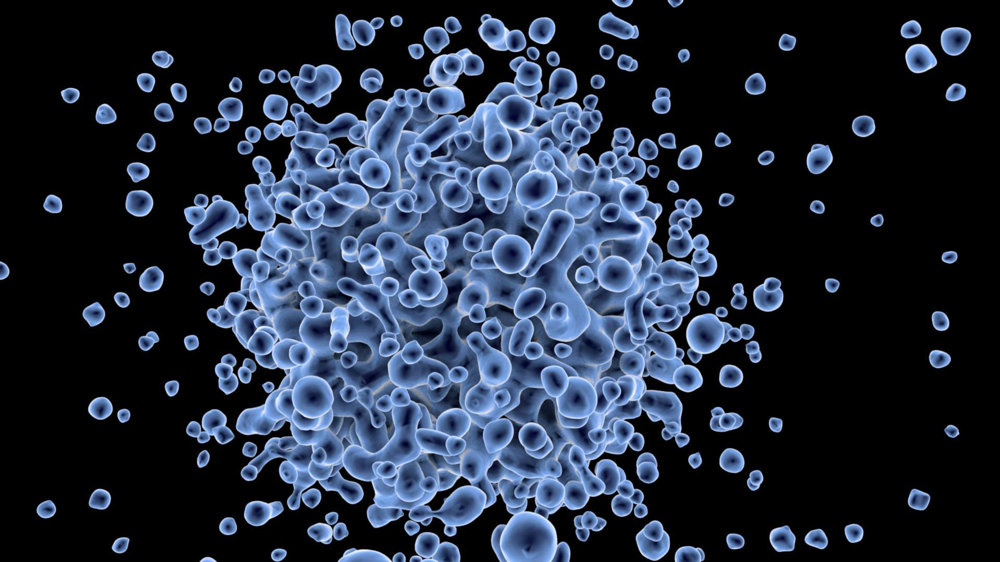
</p>
(Image from https://agfundernews.com/wp-content/uploads/2016/10/13597144015Um.jpg)

Given that the base models of our microbes are spheres, randomly displacing the sphere vertices seemed like a good approach. Of course doing so in a purely random manner would not be sufficient as we would end up with complete randomness and sharp, jagged edges. Thus, inspired by Jarrod's Perlin noise lecture, we decided to use Perlin noise to get a more organic and smooth look.

The initial approach was simple. Unity has a built in Perlin noise function ```Mathf.PerlinNoise()```, thus we can feed each vertex to the function, get the corresponding Perlin noise value, and then displace the vertex using said value to generate the final mesh. Of course there was the problem of our vertices being 3D points on a sphere, whilst the unity function is a 2D implementation. Hence we needed a function to map each 3D point to a unique 2D point, but nothing that a quick copy paste from StackOverflow couldn't solve.

And voila! Our initial implementation of organic-looking objects was complete. We could increase the number of vertices on the base sphere to get a variety of different shapes:

<p align="center">
  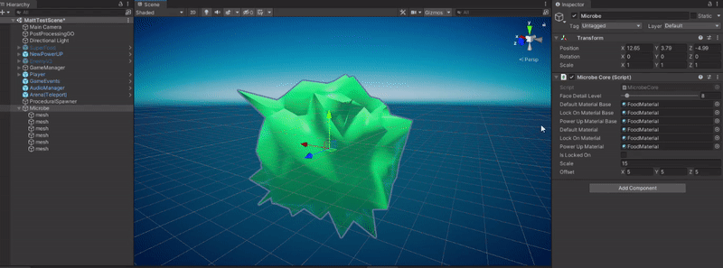
</p>

Or, we could change the offset given the Perlin noise function:
<p align="center">
  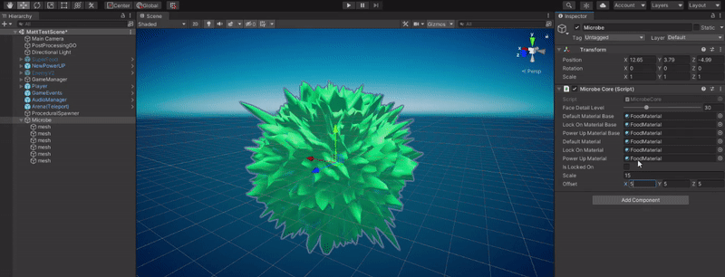
</p>

Done! There is one problem however: the microbe looks much more interesting when we move one of the settings sliders. As the mesh changes, the way the surface of the microbe moves looks much more "organic" than when completely static. To address the issue, we could change the Perlin offset every frame, and regenerate the mesh. However, to do this for every microbe in the game would be hugely costly on the CPU. Moving tens of thousands of vertices every frame on the CPU is not a good solution!

Thus we instead decided to achieve this effect using a shader. Manipulating all of these vertices on the (often hundreds) of GPU cores would greatly improve performance on devices with GPU capabilities. Unfortunately for us, the Perlin noise function is not available to us on the shader. While there is a ```noise()``` function, it is not available to us in the vertex and fragment shaders in the context we want to use them. Hence we must implement our own Perlin noise function from scratch in the shader. Since this is also a perfect opportunity for us to understand and learn the Perlin noise algorithm, we decided to take undertake this task.

To explain Perlin noise and our implementation of it, we will start with a 1D explanation, then since a 3D explanation is quite hard to visualize, we will explain the process in 2D and then extrapolate to our 3D implementation. We will heavily rely on Linkoping University's Stefan Gustavson and his 2005 paper, "*Simplex Noise Demystified*" in which he explains Perlin (and Simplex) noise in great detail.

The core idea starts with Gradient noise. Gradient noise is the idea of using random gradients to generate random numbers. In 1D, we have a number line, and for each integer on the line, we assign a random gradient. Then, for any given point, we find which two integers it lies in-between, and extrapolate the gradients of these two points. Whichever gradient reaches our desired x-value first, then the corresponding y-value of the gradient at the point would be our pseudo-random value. Of course this method of linear interpolation would give us sharp transition points:

<p align="center">
  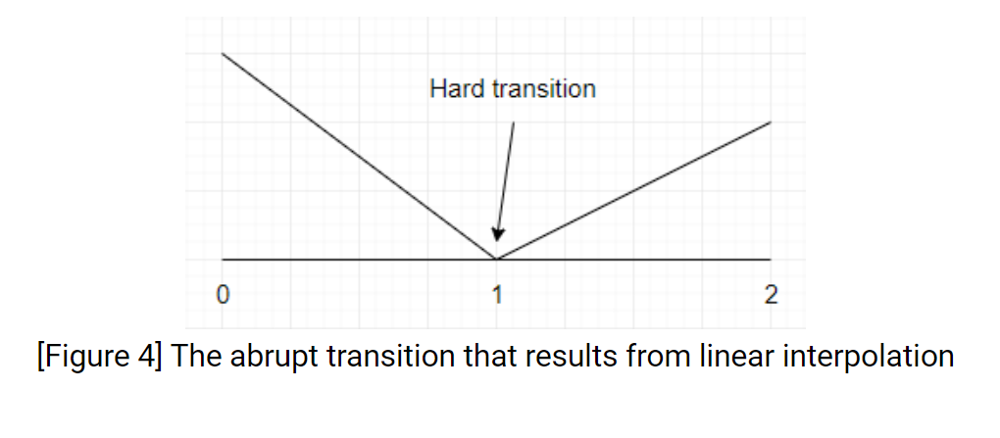
</p>

So we can use an ease curve to smooth the interpolation:

<p align="center">
  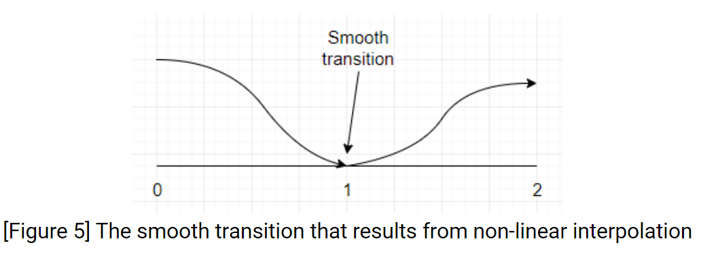
</p>
(Images from https://rtouti.github.io/graphics/perlin-noise-algorithm)

The whole process is shown nicely by this diagram in Gustavson's paper:

<p align="center">
  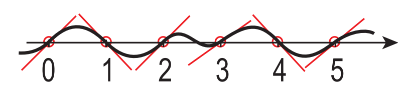
</p>
(Image from https://weber.itn.liu.se/~stegu/simplexnoise/simplexnoise.pdf)

To extrapolate this to 2D, Ken Perlin replaced the line with a grid, and for each corner point of the grid, he would come up with a random gradient. Then the random number for any point on the grid would be the interpolation of the dot products of each of the 4 surrounding corner points' gradient vector, and the vector from the corner point to the point itself:

<p align="center">
  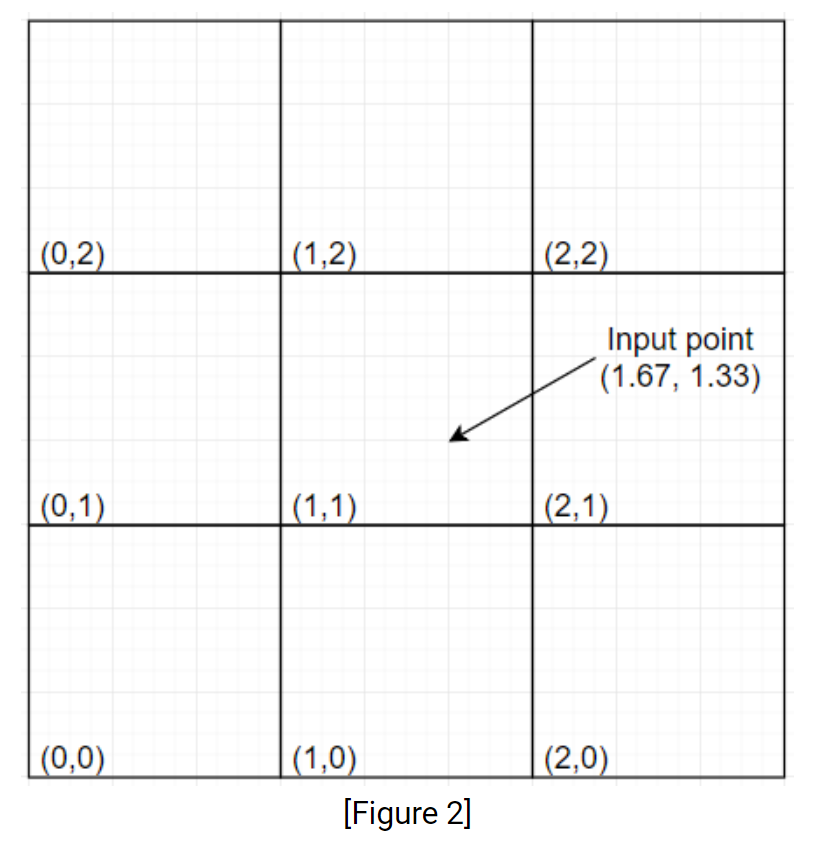
</p>
<p align="center">
  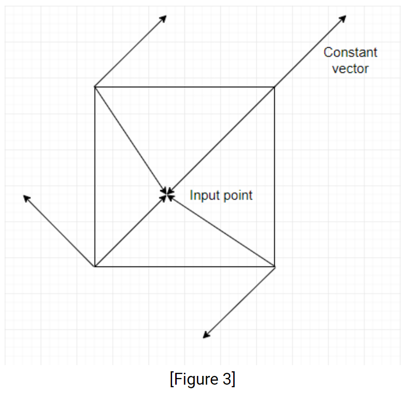
</p>
(Images from https://rtouti.github.io/graphics/perlin-noise-algorithm)

For our purposes, to further extrapolate this idea to 3D, we use a 3D grid, where each point on the grid would be on or within a cube, surrounded by the 8 vertices of a grid cube. Thus, to calculate Perlin noise in 3D, we must come up with 8 random vectors for the surrounding grid points, and take their dot products with the corresponding vector to the input point, interpolating the results to get the final Perlin value for the given point.

Thus we begin our HLSL Perlin noise function by taking the floor of the x, y and z coordinates of the given input point, which will give us the bottom corner point of the 3D cell which encloses our point (X,Y,Z):
```c
float  perlin3d(float3 inputPoint) {

	// Find the base point: The bottom corner point on the grid cube which

	// contains our point

	int X = int(floor(inputPoint.x));

	int Y = int(floor(inputPoint.y));

	int Z = int(floor(inputPoint.z));
```

We can then calculate the relative progress of each coordinate of our point from the bottom corner of the cube:
```c
float x = inputPoint.x - float(X);

float y = inputPoint.y - float(Y);

float z = inputPoint.z - float(Z);
```
Now we need a way to pick a pseudo-random gradient for each of the corner points. There are different ways that we could go about this, however we will follow Gustavson's approach, which itself follows Ken Perlin's original approach (*some of the other approaches use loops, which do not work efficiently within a GPU context*).

We start by defining an array, we call **permutations**, which contains a random shuffling of the numbers 0 to 255. According to Gustavson, many Perlin noise implementations have traditionally used the same permutation array as the one defined originally by Ken Perlin. We will follow suit and use the same array. To avoid an index overflow issue that will be described later, we will double the size of the array and duplicate all elements in the same order. This will reduce the need for index wrapping, as integer modulus operations can be a bit more expensive on the GPU.
```c
static const  int permutations[] = {
151,160,137,91,90,15,180,...,151,160,137,91,90,15,...180
};
```
Now we must map each of the corner points to one number in the permutations array, and then use that number to assign a gradient to that corner point. There is one thing to keep in mind however: the way we map a coordinate to a number has to be consistent across grid cells. That is, as shown in 2D for the figure below, **point A** is part of the 4 surrounding grid cells (*in 3D it would the 8 surrounding cubes*). If our input point is inside any of these 4 cells, then no matter which one it is in, the value we calculate for **point A** ***must be the same***. This will result in us picking the same gradient vector for **point A** every time, which is a very important aspect of achieving smooth pseudo-randomness with this algorithm. Otherwise, we would end up with sharp jagged transitions across grid cells.

<p align="center">
  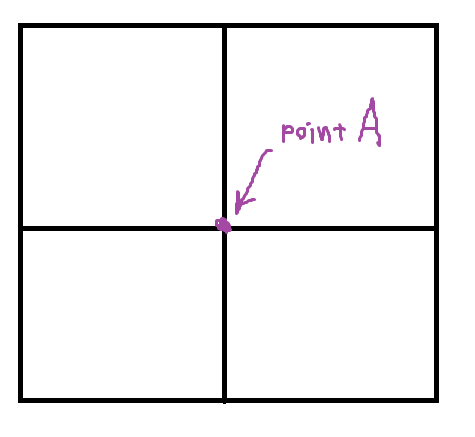
</p>

To achieve this consistency, we can use the following mapping function:
```c
X %= 255;

Y %= 255;

Z %= 255;

// Pick a number from the permutations array for each corner point

int gradientIndex000 = permutations[X + permutations[Y + permutations[Z]]] % gradCount;

int gradientIndex001 = permutations[X + permutations[Y + permutations[Z + 1]]] % gradCount;

int gradientIndex010 = permutations[X + permutations[Y + 1 + permutations[Z]]] % gradCount;

int gradientIndex011 = permutations[X + permutations[Y + 1 + permutations[Z + 1]]] % gradCount;

int gradientIndex100 = permutations[X + 1 + permutations[Y + permutations[Z]]] % gradCount;

int gradientIndex101 = permutations[X + 1 + permutations[Y + permutations[Z + 1]]] % gradCount;

int gradientIndex110 = permutations[X + 1 + permutations[Y + 1 + permutations[Z]]] % gradCount;

int gradientIndex111 = permutations[X + 1 + permutations[Y + 1 + permutations[Z + 1]]] % gradCount;
```
We wrap X, Y and Z to ensure that we do not get an index overflow, and then use the formula ```X + relativeX```, ```Y + relativeY``` and ```Z + relativeZ``` (*the ```% gradCount``` will be discussed below*). This formula guarantees that corner points are always assigned the same index, which in turn ensures that the same number is picked from the permutations array. We can illustrate this easily in 2D (*the same extrapolates to 3D*):

<p align="center">
  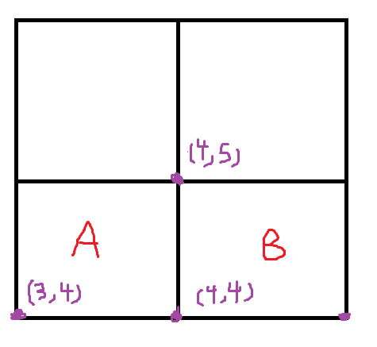
</p>

In the above figure, we can see that when we have any point within **cell A**,  X = 3 and Y = 4, and hence the index calculated for point (4,5) would be **permutations[3+1]+4+1** which gives us **permutations[4]+5**. This is because point (4,5) is 1 point in x beyond the bottom corner x (hence relativeX = 1), and also 1 point in y (hence relativeY = 1).

Similarly, if we have any point in **cell B**, X = 4 and Y = 4, and thus the index for point (4,5) would be **permutations[4+0]+4+1** which gives us **permutations[4]+5**. This is because point (4,5) is zero points in x beyond the bottom corner x of **cell B** (hence relativeX = 0), and 1 point in y above the bottom corner y (hence relativeY = 1). Notice that in both cells we got permutations[4]+5 for the same point, which means when we use the resulting value as an index into the permutations array, we will get the same value assigned to the same corner point.

It is worth mentioning that with the mapping method above, the resulting index calculated could be greater than 255, since we are adding two numbers from 0 to 255 together. This is why we doubled the size of the permutations array, to avoid index overflow.

Now, we must somehow translate each pseudo-random value assigned to each corner point into a gradient for that corner point. To do so, we will define a random array of gradients, wrap our corner value by the size of this array (```% gradCount```), and then use that as an index to access a random gradient within the array. As described by Gustavson, this gradients array should hit a balance: having too few random gradients will not hide the fact that our function is not truly random well, whilst having too many will make the function "too noisy". Thus we will follow Ken Perlin's recommendation for 3D, and take the set of mid-points of each of the 12 edges of a cube centered on the origin:

<p align="center">
  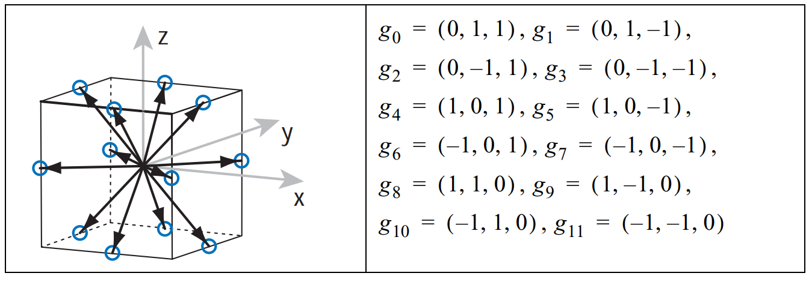
</p>
(Image from https://weber.itn.liu.se/~stegu/simplexnoise/simplexnoise.pdf)
```c
static const  int gradCount = 12;

static const  float3 gradients[] = {

float3(1,1,0),float3(-1,1,0),float3(1,-1,0),float3(-1,-1,0),

float3(1,0,1),float3(-1,0,1),float3(1,0,-1),float3(-1,0,-1),

float3(0,1,1),float3(0,-1,1),float3(0,1,-1),float3(0,-1,-1)

};
```
And now we can use our index and gradients array to pick a pseudo-random gradient for each point:
```c
float3 gradient000 = gradients[gradientIndex000];

float3 gradient001 = gradients[gradientIndex001];

...and so on
```
That's the first vector for each point done! Now we must calculate the second vector, which is simply the vector from the corner point to the given input point. We can do so by subtracting our point's relative x, y, z values we calculated before, and subtracting from them the relative coordinates of corner point (*relative to the bottom corner, so in 2D the bottom corner of the cell would be (0,0), whilst the top right corner would be (1,1)*):
```c
float3 corner000ToPoint = float3(x, y, z);

float3 corner001ToPoint = float3(x, y, z-1.0f);

float3 corner010ToPoint = float3(x, y-1.0f, z);

float3 corner011ToPoint = float3(x, y-1.0f, z-1.0f);

... and so on
```
With the two vectors for each point calculated, we can compute the dot product:
```c
float dotValue000 = dot(gradient000, corner000ToPoint);

float dotValue001 = dot(gradient001, corner001ToPoint);

float dotValue010 = dot(gradient010, corner010ToPoint);

... and so on
```
With the dot products for each of the 8 corners of our cube calculated, we can now interpolate to the results to get our final noise value. As mentioned previously, a pure linear interpolation would result in sharp transitions. Since we want our Perlin Noise to look smooth, we can use the ease curve suggested by Ken Perlin: **6t^5^ - 15t^4^ + 10t^3^**

<p align="center">
  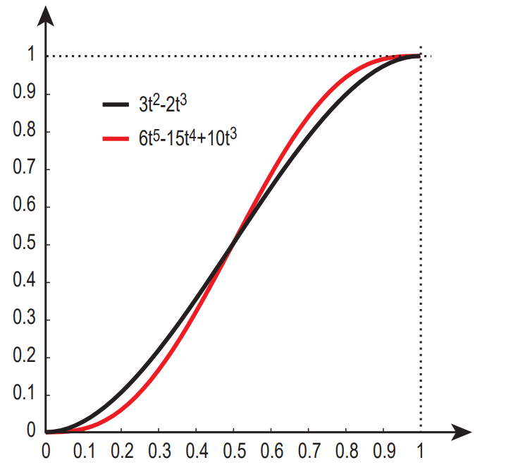
</p>
(Image from https://weber.itn.liu.se/~stegu/simplexnoise/simplexnoise.pdf)

We will use Gustavson's implementation for this function:
```c
float  fade(float t) {

	return t*t*t*(t*(t*6.0f-15.0f)+10.0f);

}
```
Using the function we will smooth our relative x, y and z values:
```c
float u = fade(x);

float v = fade(y);

float w = fade(z);
``` 
And then use the result to interpolate our dot products. First we interpolate pairs of values using the smoothed x:
```c
float bottomFrontX = lerp(dotValue000, dotValue100, u);

float bottomBackX = lerp(dotValue001, dotValue101, u);

float topFrontX = lerp(dotValue010, dotValue110, u);

float topBackX = lerp(dotValue011, dotValue111, u);
```
Then we interpolate resulting pairs using the smoothed y:
```c
float frontY = lerp(bottomFrontX, topFrontX, v);

float backY = lerp(bottomBackX, topBackX, v);
```
Finally, we interpolate the last pair using the smoothed z to get our Perlin noise value:
```c
float finalNoiseValue = lerp(frontY, backY, w);
```
With our Perlin noise function completed, we can place it in a **cginc** file called **PerlinNoise.cginc** so that we can reuse it across our shaders by simply typing ```#include PerlinNoise.cginc```

Now, we can define a vertex shader which calculates a Perlin noise value for each vertex, and then displaces the vertex using that value. Some additional control can be introduced into the formula, such as a **_Scale**, where a higher scale "zooms out" of the Perlin noise, and an **offset**:
```c
float perlinNoise = perlin3d(_Scale * v.vertex + float3(_Time.y + _OffsetX, _OffsetY, 0.0f));
v.vertex *= perlinNoise + _AdditionalOffset;
o.vertex = UnityObjectToClipPos(v.vertex);
```
Furthermore, to give a better appearance of depth to our shader, we can pass the Perlin value down to the fragment shader. We will do so by using the TEXCOORD0 channel defined in the vertex shader output struct:
```c
struct vertOut
{
float4 vertex : SV_POSITION;
float2 noise : TEXCOORD0;
};
```
And pass the value in the vertex shader. Although our noise value is (*most of the time*) within the range -1 to 1, and colors are from 0 to 1, so we need to map the value between the two ranges before we pass it down:
```c
o.noise.x = (perlinNoise + 1.0f) / 2.0f;
```
In the fragment shader:
```c
fixed4 color = fixed4(i.noise.x / 1.5f, i.noise.x / 1.5f , i.noise.x / 1.5f, 1);
```
Finally, we can introduce some properties which allows us to output different colors for when our microbes have picked up different powerups. We define these properties at the top of the file:
```c
_IsInvincible ("Invicibility Effect", Float) = 0.0
_IsSpeed ("Speed Powerup Effect", Float) = 0.0
_IsMagnet ("Magnet Powerup Effect", Float) = 0.0
```
Which we then use in "if" statements to get different color effects. Here, we use expressions such as ```(_SinTime.w + 1.0f)``` or ```(sin(_Time.w * 1.7f) + 1.0f)``` to get a shader which changes color over time.
```c
if (_IsInvincible > 0.1) {
color = fixed4(i.noise.x / 1.5f, (sin(_Time.w * 1.7f) + 1.0f) / 2.5f , i.noise.x / 1.5f, 1);
}
if (_IsSpeed > 0.1) {
color = fixed4((sin(_Time.w * 1.7f) + 1.0f) / 2.5f, i.noise.x / 1.5f , i.noise.x / 1.5f, 1);
}
if (_IsMagnet > 0.1) {
color = fixed4(i.noise.x / 1.3f, i.noise.x / 1.3f , (_SinTime.w + 1.0f) / 2.0f, 1);
}
```
And now we can display "organic-looking" objects on screen:
<p align="center">
  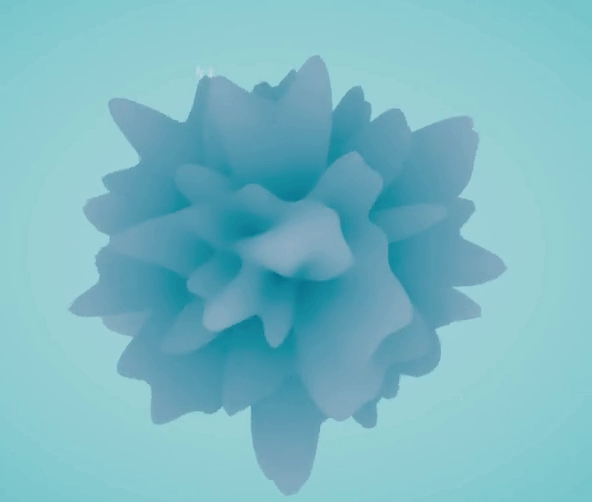
</p>


